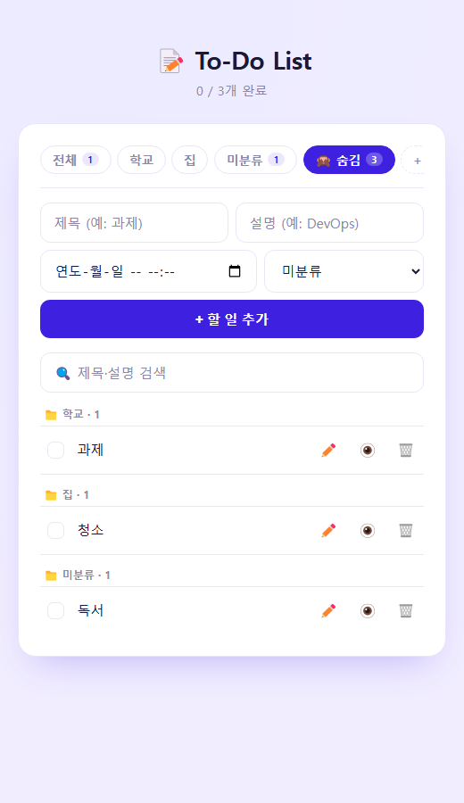
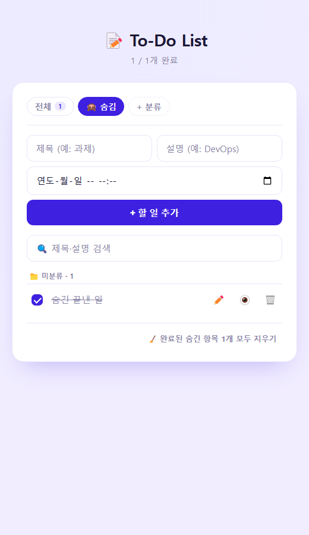
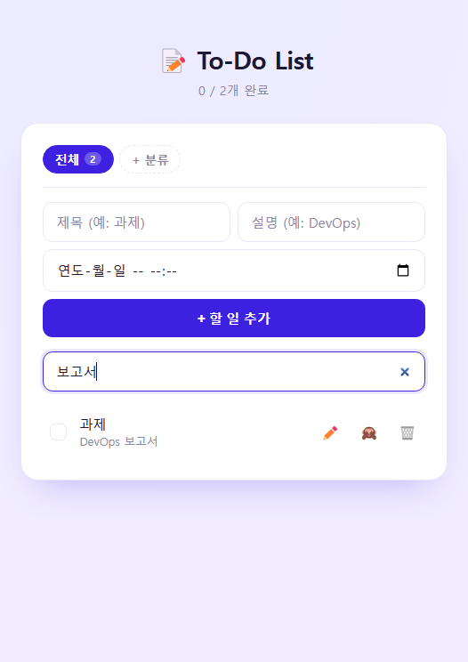
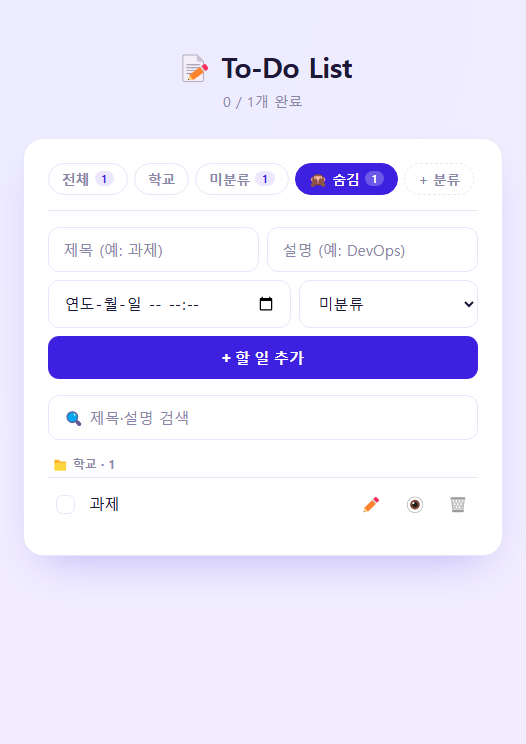
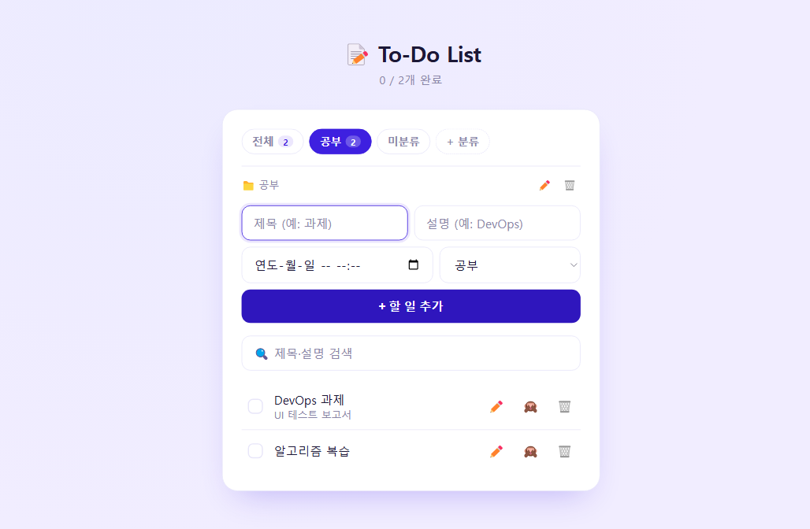
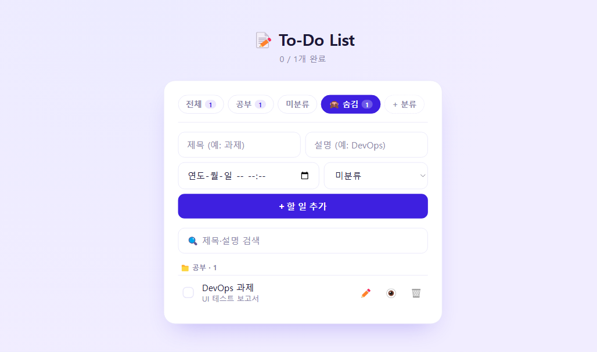
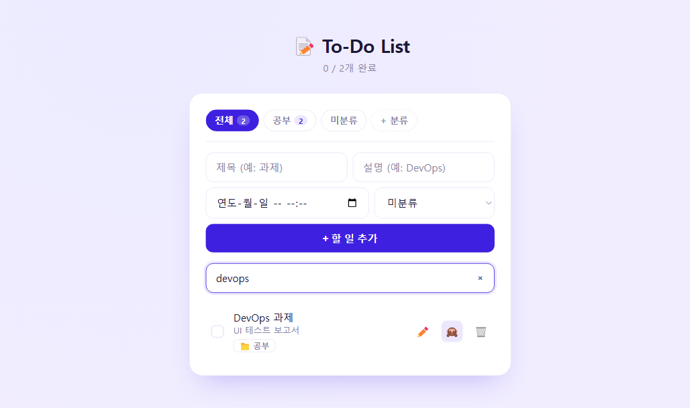
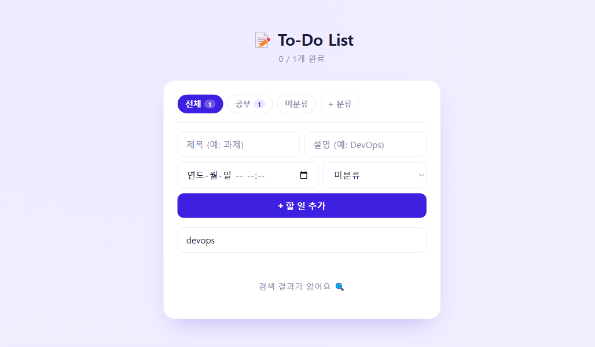

# UI 테스트 보고서 — FastAPI To-Do List

- 작성일: 2026-10-06
- 대상: `feat/hide-search` 브랜치 (숨기기 · 검색 · 완료 항목 일괄 삭제 기능 추가 버전)
- 도구: Claude Code + Playwright 1.63 (Python) + Selenium 4.50 (Python), Chrome 154 (headless) + Playwright MCP (탐색 테스트)
- 결과: **16개 테스트 전부 통과** (Playwright 10 · Selenium 6), 3회 연속 실행에서도 모두 통과 (불안정한 테스트 없음)
- 상세 결과: [`report/ui_test_report.html`](report/ui_test_report.html) (pytest-html)

## 1. 테스트 환경과 방법

| 항목 | 내용 |
|---|---|
| 앱 서버 | 테스트 시작 시 `uvicorn main:app` 을 빈 포트로 자동 실행 |
| 데이터 격리 | `DATA_DIR` 환경변수로 임시 폴더를 데이터 위치로 지정 → 실제 `todo.json` 은 건드리지 않음. 테스트마다 json 을 `[]` 로 초기화 |
| 사전 데이터 | 화면 조작 전에 필요한 데이터는 API(`POST /todos`, `POST /categories`)로 바로 생성 |
| 브라우저 | 설치된 Chrome 사용 (Playwright `channel="chrome"`, Selenium Manager 가 맞는 chromedriver 준비) |
| 화면 크기 | 520×900 (모바일에 가까운 폭) |
| 대화상자 | `confirm()` / `prompt()` 는 Playwright `page.once("dialog")`, Selenium `switch_to.alert` 로 처리 |

```
ui_tests/
├── conftest.py             # 서버 실행, 데이터 초기화, API 도우미, 스크린샷 경로
├── test_ui_playwright.py   # Playwright 테스트 10개
├── test_ui_selenium.py     # Selenium 테스트 6개
├── requirements.txt
└── report/                 # pytest-html 보고서, 스크린샷
```

실행 방법:
```bash
pip install -r fastapi-app/requirements.txt -r ui_tests/requirements.txt
pytest ui_tests --html=ui_tests/report/ui_test_report.html --self-contained-html
```

## 2. 테스트 항목과 결과

| # | 시나리오 | Playwright | Selenium | 확인 내용 |
|---|---|:-:|:-:|---|
| 1 | 할 일 추가 | ✅ | ✅ | 목록에 표시, 설명 표시, "0 / 1개 완료", 입력칸 초기화 |
| 2 | 제목 없이 추가 | ✅ | – | 브라우저 `required` 검사로 막힘 |
| 3 | 완료 체크 | ✅ | ✅ | 취소선(`done`), "1 / 1개 완료", 일괄 삭제 버튼에 개수 표시 |
| 4 | 마감 표시 | ✅ | – | 지난 마감 = 빨강(`overdue`), 3일 이내 = 주황(`soon`) |
| 5 | **검색** | ✅ | ✅ | 제목·설명 검색, 대소문자 무시, 결과 없음 안내, 검색어 지우면 복구 |
| 6 | **숨기기 + 자동 분류** | ✅ | ✅ | 숨기면 일반 목록에서 사라짐, 숨김 탭 생성, 분류 순서대로 묶임(미분류는 맨 뒤) |
| 7 | **다시 보이기** | ✅ | ✅ | 숨긴 항목이 없어지면 숨김 탭이 사라지고 전체 탭으로 복귀 |
| 8 | **완료 항목 일괄 삭제** | ✅ | ✅ | 확인 창 취소 시 유지, 확인 시 삭제, 숨긴 완료 항목은 남음, 버튼 숨김 |
| 9 | 분류 추가 · 필터 | ✅ | ✅ | `prompt` 로 분류 추가, 새 탭 선택, 추가 폼 기본 분류, 탭별 필터, 전체 탭의 분류 표시 |
| 10 | 할 일 삭제 | ✅ | – | 확인 후 삭제, 빈 목록 안내 |

굵게 표시한 항목이 이번에 새로 추가한 기능이다. 핵심 시나리오(1, 3, 5~9)는 두 도구로 모두 검증했다.

### 실행 시간

| 도구 | 테스트 수 | 테스트 본문 실행 시간 합계 |
|---|---|---|
| Playwright | 10 | 약 3.5초 |
| Selenium | 6 | 약 6.5초 |

(브라우저·서버 시작 포함 전체 실행은 약 19초)

## 3. 화면 캡처

| 숨김 탭 — 분류별 자동 묶음 (Playwright) | 숨긴 완료 항목만 남은 상태 (Playwright) |
|---|---|
|  |  |

| 검색 "보고서" (Selenium) | 숨김 탭 (Selenium) |
|---|---|
|  |  |

그 밖의 캡처는 [`report/screenshots/`](report/screenshots/) 에 있다.

## 4. 발견한 점

기능 오류는 발견되지 않았다. 테스트 중 확인한 개선점과 테스트 작성 시 겪은 문제는 다음과 같다.

| # | 구분 | 내용 | 제안 |
|---|---|---|---|
| 1 | UX | 검색 중에도 상단 "N / M개 완료" 는 검색 결과가 아닌 탭 전체 기준이다 (검색 캡처: 1개 표시, "0 / 2개 완료") | 검색 중에는 "검색 결과 1개" 처럼 표시 |
| 2 | UX | 폭이 좁을 때 분류가 많으면 "+ 분류" 버튼이 화면 오른쪽 밖으로 밀린다 (숨김 탭 캡처) | 가로 스크롤 힌트(그림자) 또는 버튼을 탭 목록 밖에 고정 |
| 3 | UX · 테스트 | 수정이 `prompt()` 창을 최대 4번 연속으로 띄우는 방식이라 사용성이 낮고 UI 자동화도 어렵다 | 항목 안에서 바로 고치는 인라인 편집 폼으로 변경 |
| 4 | 테스트 | 캡처 시점에 목록의 fade-in 애니메이션(0.15초)이 진행 중이면 항목이 흐릿하게 찍혔다 | Playwright `screenshot(animations="disabled")` 로 해결 |
| 5 | 테스트 | Selenium 에서 `StaleElementReferenceException` 발생 — 화면이 데이터를 다시 불러올 때마다 목록을 새로 그려서, 이전에 찾은 요소가 사라짐 | `WebDriverWait(ignored_exceptions=[StaleElementReferenceException])` 로 재시도. Playwright 는 Locator 가 매번 요소를 다시 찾아서 같은 문제가 없었다 |
| 6 | 접근성 (MCP) | 아이콘 버튼의 접근성 이름이 이모지 자체다 (`button "✏️"`, `button "🙈"`). `title` 속성이 있지만 버튼 안에 글자가 있어 이름으로 쓰이지 않는다 | `aria-label="수정"` 처럼 이름을 따로 지정 |
| 7 | 콘솔 (MCP) | 페이지를 열 때마다 `favicon.ico` 404 오류가 콘솔에 찍힌다 | `<link rel="icon" href="data:,">` 또는 이모지 SVG 파비콘 추가 |

## 5. Playwright 와 Selenium 비교

| 항목 | Playwright | Selenium |
|---|---|---|
| 대기 | `expect()` 가 조건이 맞을 때까지 자동 재시도 | `WebDriverWait` + 조건을 직접 작성 |
| 다시 그려지는 요소 | Locator 가 매번 새로 찾아 문제 없음 | stale 요소 예외를 따로 처리해야 함 |
| 대화상자 | 이벤트 핸들러를 미리 등록 (`page.once("dialog")`) | 뜬 다음 `switch_to.alert` 로 전환 |
| 속도 (테스트당 평균) | 약 0.35초 | 약 1.1초 (단, Selenium 쪽 시나리오가 단계가 더 많은 편) |
| 코드 양 | 도우미 함수 3개 (`todo_row`, `tab`, `add_todo`) | 도우미 함수 9개 (대기·요소 찾기·대화상자 처리) |
| 장점 | 자동 대기, 애니메이션 끄기 등 테스트 편의 기능 | W3C WebDriver 표준, 다양한 언어·브라우저·클라우드 그리드 지원 |

이 프로젝트처럼 화면을 자주 새로 그리는 SPA 형태에서는 Playwright 쪽이 작성과 유지보수가 쉬웠다.

## 6. Claude Code 연동

- Claude Code 가 테스트 코드 작성 → 실행 → 실패 원인 분석(stale 요소, 애니메이션) → 수정 → 재실행 → 캡처 확인 → 보고서 작성까지 진행했다.
- 이어서 **Playwright MCP** 로 탐색 테스트를 했다 (아래 6.1).

### 6.1 Playwright MCP 탐색 테스트

테스트 코드를 쓰지 않고, Claude Code 가 MCP 도구로 브라우저를 직접 조작하며 화면을 확인했다.

```bash
claude mcp add playwright npx @playwright/mcp@latest   # MCP 서버 등록 (등록 후 Claude Code 재시작)
```

- 서버: `DATA_DIR=<임시 폴더> uvicorn main:app --port 8000` (실제 데이터와 분리)
- 사용한 MCP 도구: `browser_navigate`, `browser_snapshot`(접근성 트리), `browser_click`, `browser_type`, `browser_fill_form`, `browser_handle_dialog`, `browser_take_screenshot`, `browser_console_messages`
- 방식: 매 단계 `browser_snapshot` 으로 접근성 트리를 읽고 → 다음에 누를 요소를 고르고 → 결과를 다시 snapshot 으로 확인

| # | 조작 | 확인한 결과 | |
|---|---|---|:-:|
| 1 | "+ 분류" → `prompt` 에 "공부" 입력 | 공부·미분류 탭 생성, 공부 탭 선택, 추가 폼 분류가 "공부"로 선택됨 | ✅ |
| 2 | 할 일 2개 추가 (버튼 클릭 / Enter) | 두 방식 모두 추가, "0 / 2개 완료", 탭 개수 2 | ✅ |
| 3 | "DevOps 과제" 숨기기 🙈 | 목록에서 사라지고 "🙈 숨김 1" 탭 생성 | ✅ |
| 4 | 숨김 탭 열기 | "📁 공부 · 1" 묶음 제목 아래 표시, 버튼이 👁️ 로 바뀜 | ✅ |
| 5 | 👁️ 다시 보이기 | 숨김 탭이 사라지고 전체 탭으로 복귀, 📁 분류 뱃지 표시 | ✅ |
| 6 | 검색 "devops" (한 글자씩 입력) | 대소문자 무시하고 "DevOps 과제" 만 표시 | ✅ |
| 7 | 검색 중 완료 체크 | 검색어 유지된 채 체크, "🧹 완료된 항목 1개 모두 지우기" 버튼 등장 | ✅ |
| 8 | 일괄 삭제 → `confirm` **취소** | 항목 그대로 유지 | ✅ |
| 9 | 일괄 삭제 → `confirm` **확인** | 삭제, "검색 결과가 없어요 🔍" 안내 | ✅ |
| 10 | 콘솔 메시지 확인 | 앱 오류 없음, `favicon.ico` 404 만 있음 (발견한 점 7) | ⚠️ |

| 분류 추가 직후 | 숨김 탭 — 분류별 묶음 |
|---|---|
|  |  |

| 검색 "devops" | 일괄 삭제 후 |
|---|---|
|  |  |

**스크립트 테스트와 비교**

| 항목 | 스크립트 (pytest) | Playwright MCP |
|---|---|---|
| 용도 | 같은 시나리오를 반복 실행하는 회귀 테스트 | 처음 보는 기능을 눌러보며 확인하는 탐색 테스트 |
| 요소 찾기 | 사람이 셀렉터를 미리 작성 | snapshot(접근성 트리)을 보고 Claude 가 그때그때 선택 |
| 장점 | 빠르고(16개 약 19초) 결과가 매번 같음, CI 에 넣을 수 있음 | 코드 없이 바로 시작, 예상 못 한 상태도 보고 판단 |
| 한계 | 미리 적은 것만 확인 | 단계마다 도구 호출이 필요해 느리고, 결과를 다시 실행하려면 스크립트로 옮겨야 함 |
| 이번에 찾은 것 | – | 접근성 트리에서 버튼 이름 문제(발견한 점 6), 콘솔 404(발견한 점 7) |

## 7. 다음 단계

- 발견한 점 1~3, 6~7 개선
- CI(Jenkins)에 UI 테스트 단계 추가 — Jenkins 에이전트에 Chrome 설치 필요
- 다크 모드, 모바일 화면 크기 등 화면 조건별 캡처 비교
